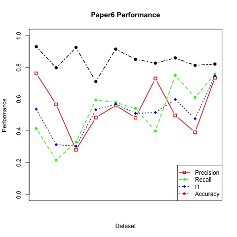

In this project, we implemented the algorithms from **paper1** and **paper6 (with C2 constraint)** to deal with name disambiguation problem. Both of the papers use unsupervised learning algorithm to cluster publications from each of the authors.

## Step 0: Load the packages

```{r, message=FALSE,echo=FALSE}
#data_list from clean_data.rmd
packages.used=c("text2vec", "knitr", "cluster", "stringr")
packages.needed=setdiff(packages.used, 
                        intersect(installed.packages()[,1], 
                                  packages.used))

if(length(packages.needed)>0){
  install.packages(packages.needed, dependencies = TRUE)
}
library(knitr)
library(cluster)
library(text2vec)
library(stringr)
```

## Step 1: Load and process the data

```{r,echo=FALSE}
data.lib="../data/nameset"
data.files=list.files(path=data.lib, "*.txt")
## remove "*.txt"
query.list=substring(data.files, 
                     1, nchar(data.files)-4)
## add a space
query.list=paste(substring(query.list, 1, 1), 
                 " ", 
                 substring(query.list, 
                           2, nchar(query.list)),
                 sep=""
                 )
f.line.proc=function(lin, nam.query="."){

  # remove unwanted characters
  char_notallowed <- "\\@#$%^&?" # characters to be removed
  lin.str=str_replace(lin, char_notallowed, "")

  # get author id
  lin.str=strsplit(lin.str, "_")[[1]]
  author_id=as.numeric(lin.str[1])
  
  # get paper id
  lin.str=lin.str[2]
  paper_id=strsplit(lin.str, " ")[[1]][1]
  lin.str=substring(lin.str, nchar(paper_id)+1, nchar(lin.str))
  paper_id=as.numeric(paper_id)
  
  # get coauthor list
  lin.str=strsplit(lin.str, "<>")[[1]]
  coauthor_list=strsplit(lin.str[1], ";")[[1]]

  #print(lin.str)
  for(j in 1:length(coauthor_list)){
      if(nchar(coauthor_list[j])>0){
        nam = strsplit(coauthor_list[j], " ")[[1]]
        if(nchar(nam[1])>0){
          first.ini=substring(nam[1], 1, 1)
        }else{
          first.ini=substring(nam[2], 1, 1)
        }
      }
      last.name=nam[length(nam)]
      nam.str = paste(first.ini, last.name)
      coauthor_list[j]=nam.str
  }
  
  match_ind = charmatch(nam.query, coauthor_list, nomatch=-1)
 
  if(match_ind>0){
    
    coauthor_list=coauthor_list[-match_ind]
  }
  
  paper_title=lin.str[2]
  journal_name=lin.str[3]
  
  list(author_id, 
       paper_id, 
       coauthor_list, 
       paper_title, 
       journal_name)
}
data_list=list(1:length(data.files))

for(i in 1:length(data.files)){
  ## Step 0 scan in one line at a time.
  
  dat=as.list(readLines(paste(data.lib, data.files[i], sep="/")))
  data_list[[i]]=lapply(dat, f.line.proc, nam.query=query.list[i])
  
}
source("../lib/paper1_func.R")
source("../lib/cd_cluster_func.R")
source("../lib/cd_cluster.R")
source("../lib/p6_function.R")
source("../lib/evaluation_measures.R")
```

## **Paper 1**

The algorithm of paper 1 is relatively simple. We only consider explicit coauthor feature. Basically, we pairwisely cluster publications by counting matched coauthors between the two authors.

### Experiment Design
* Features:
Coauthor matrix
Each element xij in the matrix X represents the count of matched coauthors between publications i and j.

* Tuned Parameters: 
Theta = 1 
This means we will stop clustering when none of the author-pair from any two clusters share a coauthor.

* Algorithm: 
For the initialization, we think of each publications as a single cluster. Then we find the most similar author-pair (the maximum entry in coauthor matrix). Then we merge the corresponding two clusters into a new cluster. We iterate this process until it hits the threshold theta.

* Evaluation: 
we use matching matrix to evaluate our results (following the function in TA's code)

Due to the imperfect data, we applied three methods trying to improve the result of the clustering algorithm.
1 Leave papers only with the main author or with one unique coauthor as individual cluster
2 Combine papers methioned above to one cluster
3 Delete those papers

The overall performance are shown as the table below 
```{r,eval=FALSE}
start.time <- Sys.time()
table1<-matrix(0, nrow = 2, ncol = 2)
accuracy1<-c()
ratio<-c()
result1<-list()
for(k in 1:length(data_list)){

  result1[[k]]<-paper1_indiv(k)
  table1<-table1+result1[[k]][[1]]
  accuracy1[k]<-result1[[k]][[2]]$accuracy
  ratio[k]<-result1[[k]][[3]]

  result1<-paper1_indiv(k)

  table1<-table1+result1[[1]]

  table1<-table+result1[[1]]

  accuracy1[k]<-result1[[2]]$accuracy
  ratio[k]<-result1[[3]]

}
eval1<-performance_statistics(table1)
#plot(ratio, accuracy1, main = "Number of Paper per Author for Each Dataset vs Accuracy")
end.time <- Sys.time()
time1 <- end.time - start.time
#table1
```
```{r,eval=FALSE}
start.time <- Sys.time()
table2<-matrix(0, nrow = 2, ncol = 2)
accuracy2<-c()
result2<-list()
for(k in 1:length(data_list)){
  result2[[k]]<-combinecluster(cd_cluster(k))
  table2<-table2+result2[[k]][[1]]
  accuracy2[k]<-result2[[k]][[2]]$accuracy
}
eval2<-performance_statistics(table2)
#plot(ratio, accuracy2, main = "Number of Paper per Author for Each Dataset vs Accuracy")
end.time <- Sys.time()
time2 <- end.time - start.time
#table2
```
```{r,eval=FALSE}
start.time <- Sys.time()
table3<-matrix(0, nrow = 2, ncol = 2)
accuracy3<-c()
result3<-list()
for(k in 1:length(data_list)){
  result3[[k]]<-deletecluster(cd_cluster(k))
  table3<-table3+result3[[k]][[1]]
  accuracy3[k]<-result3[[k]][[2]]$accuracy
}
eval3<-performance_statistics(table3)
#plot(ratio, accuracy3, main = "Number of Paper per Author for Each Dataset vs Accuracy")
end.time <- Sys.time()
time3 <- end.time - start.time
#table3
```
```{r,eval=FALSE}
compare_df <- data.frame(method=c("Individual Cluster","Combine Cluster","Delete Cluster"),
                         precision=c(eval1$precision, eval2$precision, eval3$precision),
                         recall=c(eval1$recall, eval2$recall, eval3$recall),
                         f1=c(eval1$f1, eval2$f1, eval3$f1),
                         accuracy=c(eval1$accuracy, eval2$accuracy, eval3$accuracy),
                         time=c(time1,time2, time3))
result_table<-kable(compare_df,caption="Comparision of performance for three clustering methods",digits = 2)
#result_table
save(eval1, eval2, eval3, ratio, accuracy1, accuracy2, accuracy3, time1, time2, time3, result_table, table1, table2, table3, file = "../output/paper1.RData")
```
```{r,echo=FALSE}
load("../output/paper1.RData")
result_table
```

### Then we want to find some pattern about the accuracy and ratio (The average number of paper for each author). So change result matrix of each dataset to 14*4 dataframe which can be fed to the "cluster" package 
```{r,eval=FALSE}
load("../output/paper1.RData")
A <- unlist(result1[[1]][2])
for(i in 2:14){
  t <- unlist(result1[[i]][2])
  t <- as.data.frame(t)
  A <- cbind(A, t)
}
colnames(A) <- c(1:14)
A <- t(A)
print(A)
```


### cluster 
We use four features(precision, recall, fi, accuracy) of each dataset for feeding the kmeans algorithm.
according to the whith "Within groups sum of squares", we choose to have four clusters.

According to the cluster result we calculate the mean accuracy and ratio of each cluster, we found that datasets with higher ratio tend to have higher accuracy which means the algorithm in paper1 is sensitive to the ratio of dataset and improvement needed. (the result shown in Figure 1)
```{r,eval=FALSE, echo=FALSE}
wss <- (nrow(A)-1)*sum(apply(A,2,var))
for (i in 2:5){
  wss[i] <- sum(kmeans(A, centers=i)$withinss)
}
plot(1:5, wss, type="b", xlab="Number of Clusters",
     ylab="Within groups sum of squares")

set.seed(1000)
clus <- kmeans(A, 4)
print(clus$cluster)

clusplot(A, clus$cluster, color=TRUE, shade=TRUE, 
         labels=2, lines=0)

c1_accuracy <- mean(accuracy1[3], accuracy1[6], accuracy1[11])
c2_accuracy <- mean(accuracy1[1], accuracy1[4], accuracy1[7], accuracy1[12])
c3_accuracy <- mean(accuracy1[2], accuracy1[9])
c4_accuracy <- mean(accuracy1[5], accuracy1[8], accuracy1[13], accuracy1[14])

c1_ratio <- mean(ratio[3], ratio[6], ratio[11])
c2_ratio <- mean(ratio[1], ratio[4], ratio[7], ratio[12])
c3_ratio  <- mean(ratio[2], ratio[9])
c4_ratio  <- mean(ratio[5], ratio[8], ratio[13], ratio[14])

cluser_accuracy <- c(c1_accuracy, c2_accuracy, c3_accuracy, c4_accuracy)
cluster_ratio <- c(c1_ratio, c2_ratio, c3_ratio, c4_ratio)
plot(cluster_ratio, cluser_accuracy)
```


## **Paper 6**

This paper uses a constraint-based probabilistic framework and EM algorithm to do the clustering. We only consider c2 constraint (if two publications share at least one coauthor, then they satisfy the constraint).

### Experiment Design
* Features: 
We use "Paper Name" and "Journal Title" to extract features for each publication. More specifically, we use TF-IDF to construct a dtm matrix as our feature matrix.   
* Tuned parameters: 
step size = 0.01
* Algorithm: 
objective function we want to minimize: **$\sum\limits_{i}$$\sum\limits_{j}${ D(xi,xj) I(li$\neq$lj) w2 c2(xi,xj) } + $\sum\limits_{xi}$ D(xi,yh)**

The first term measures the distance between two publications which satisfy the constraint but not in the same cluster. The second term measures the distance between xi and its cluster centroid yh. For the initialization, we cluster publications based on c2 constraint. Then we use EM algorithm to re-assign each publication and update corresponding parameters.

* Evaluation:
We also use matching matrix to evaluate our results.

The overall performance are shown as the table below (running the whole EM algorithm may take a few hours)

```{r, eval=FALSE, echo=FALSE}
##########
c2_mtx1 <- p6_compute_c2(1)
X1 <- feature(1)
K1 <- length(unique(paper6_authorID(1)))
intl_groups1 <- p6_initialization(c2_mtx=c2_mtx1, X=X1, K=K1)$intl_groups
Y1 <- p6_initialization(c2_mtx=c2_mtx1, X=X1, K=K1)$Y
result1 <- p6_train_EM(c2_mtx=c2_mtx1, intl_groups=intl_groups1, X=X1, Y=Y1, K=K1)
##########
c2_mtx2 <- p6_compute_c2(2)
X2 <- feature(2)
K2 <- length(unique(paper6_authorID(2)))
intl_groups2 <- p6_initialization(c2_mtx=c2_mtx2, X=X2, K=K2)$intl_groups
Y2 <- p6_initialization(c2_mtx=c2_mtx2, X=X2, K=K2)$Y
result2 <- p6_train_EM(c2_mtx=c2_mtx2, intl_groups=intl_groups2, X=X2, Y=Y2, K=K2)
##########
c2_mtx3 <- p6_compute_c2(3)
X3 <- feature(3)
K3 <- length(unique(paper6_authorID(3)))
intl_groups3 <- p6_initialization(c2_mtx=c2_mtx3, X=X3, K=K3)$intl_groups
Y3 <- p6_initialization(c2_mtx=c2_mtx3, X=X3, K=K3)$Y
result3 <- p6_train_EM(c2_mtx=c2_mtx3, intl_groups=intl_groups3, X=X3, Y=Y3, K=K3)
##########
c2_mtx4 <- p6_compute_c2(4)
X4 <- feature(4)
K4 <- length(unique(paper6_authorID(4)))
intl_groups4 <- p6_initialization(c2_mtx=c2_mtx4, X=X4, K=K4)$intl_groups
Y4 <- p6_initialization(c2_mtx=c2_mtx4, X=X4, K=K4)$Y
result4 <- p6_train_EM(c2_mtx=c2_mtx4, intl_groups=intl_groups4, X=X4, Y=Y4, K=K4)
##########
c2_mtx5 <- p6_compute_c2(5)
X5 <- feature(5)
K5 <- length(unique(paper6_authorID(5)))
intl_groups5 <- p6_initialization(c2_mtx=c2_mtx5, X=X5, K=K5)$intl_groups
Y5 <- p6_initialization(c2_mtx=c2_mtx5, X=X5, K=K5)$Y
result5 <- p6_train_EM(c2_mtx=c2_mtx5, intl_groups=intl_groups5, X=X5, Y=Y5, K=K5)
##########
c2_mtx6 <- p6_compute_c2(6)
X6 <- feature(6)
K6 <- length(unique(paper6_authorID(6)))
intl_groups6 <- p6_initialization(c2_mtx=c2_mtx6, X=X6, K=K6)$intl_groups
Y6 <- p6_initialization(c2_mtx=c2_mtx6, X=X6, K=K6)$Y
result6 <- p6_train_EM(c2_mtx=c2_mtx6, intl_groups=intl_groups6, X=X6, Y=Y6, K=K6)
##########
c2_mtx7 <- p6_compute_c2(7)
X7 <- feature(7)
K7 <- length(unique(paper6_authorID(7)))
intl_groups7 <- p6_initialization(c2_mtx=c2_mtx7, X=X7, K=K7)$intl_groups
Y7 <- p6_initialization(c2_mtx=c2_mtx7, X=X7, K=K7)$Y
result7 <- p6_train_EM(c2_mtx=c2_mtx7, intl_groups=intl_groups7, X=X7, Y=Y7, K=K7)
# ##########
c2_mtx8 <- p6_compute_c2(8)
X8 <- feature(8)
K8 <- length(unique(paper6_authorID(8)))
intl_groups8 <- p6_initialization(c2_mtx=c2_mtx8, X=X8, K=K8)$intl_groups
Y8 <- p6_initialization(c2_mtx=c2_mtx8, X=X8, K=K8)$Y
result8 <- p6_train_EM(c2_mtx=c2_mtx8, intl_groups=intl_groups8, X=X8, Y=Y8, K=K8)
##########
c2_mtx9 <- p6_compute_c2(9)
X9 <- feature(9)
K9 <- length(unique(paper6_authorID(9)))
intl_groups9 <- p6_initialization(c2_mtx=c2_mtx9, X=X9, K=K9)$intl_groups
Y9 <- p6_initialization(c2_mtx=c2_mtx9, X=X9, K=K9)$Y
result9 <- p6_train_EM(c2_mtx=c2_mtx9, intl_groups=intl_groups9, X=X9, Y=Y9, K=K9)
##########
c2_mtx10 <- p6_compute_c2(10)
X10 <- feature(10)
K10 <- length(unique(paper6_authorID(10)))
intl_groups10 <- p6_initialization(c2_mtx=c2_mtx10, X=X10, K=K10)$intl_groups
Y10 <- p6_initialization(c2_mtx=c2_mtx10, X=X10, K=K10)$Y
result10 <- p6_train_EM(c2_mtx=c2_mtx10, intl_groups=intl_groups10, X=X10, Y=Y10, K=K10)
##########
c2_mtx11 <- p6_compute_c2(11)
X11 <- feature(11)
K11 <- length(unique(paper6_authorID(11)))
intl_groups11 <- p6_initialization(c2_mtx=c2_mtx11, X=X11, K=K11)$intl_groups
Y11 <- p6_initialization(c2_mtx=c2_mtx11, X=X11, K=K11)$Y
result11 <- p6_train_EM(c2_mtx=c2_mtx11, intl_groups=intl_groups11, X=X11, Y=Y11, K=K11)
##########
c2_mtx12 <- p6_compute_c2(12)
X12 <- feature(12)
K12 <- length(unique(paper6_authorID(12)))
intl_groups12 <- p6_initialization(c2_mtx=c2_mtx12, X=X12, K=K12)$intl_groups
Y12 <- p6_initialization(c2_mtx=c2_mtx12, X=X12, K=K12)$Y
result12 <- p6_train_EM(c2_mtx=c2_mtx12, intl_groups=intl_groups12, X=X12, Y=Y12, K=K12)
##########
c2_mtx13 <- p6_compute_c2(13)
X13 <- feature(13)
K13 <- length(unique(paper6_authorID(13)))
intl_groups13 <- p6_initialization(c2_mtx=c2_mtx13, X=X13, K=K13)$intl_groups
Y13 <- p6_initialization(c2_mtx=c2_mtx13, X=X13, K=K13)$Y
result13 <- p6_train_EM(c2_mtx=c2_mtx13, intl_groups=intl_groups13, X=X13, Y=Y13, K=K13)
# ##########
c2_mtx14 <- p6_compute_c2(14)
X14 <- feature(14)
K14 <- length(unique(paper6_authorID(14)))
intl_groups14 <- p6_initialization(c2_mtx=c2_mtx14, X=X14, K=K14)$intl_groups
Y14 <- p6_initialization(c2_mtx=c2_mtx14, X=X14, K=K14)$Y
result14 <- p6_train_EM(c2_mtx=c2_mtx14, intl_groups=intl_groups14, X=X14, Y=Y14, K=K14)
# ##########
```
```{r,echo=FALSE}
load("../output/paper6.RData")
overall_table
overall_performance
```





## **Comparison and Conclusion**

Paper | Precision | Recall | f1 | Accuracy  | Time
------------- | ------------- | ------------- | ------------- | ------------- | ------------- 
1 | 0.09 | 0.72 | 0.17 | 0.52 | 4.613901 mins  
6 | 0.55 | 0.53 | 0.54 | 0.88 | A few hours

Based on the overall performance, although it may take longer to run EM algorithm, we can see that algorithm of paper 6 is much better than that of paper 1 in general.

