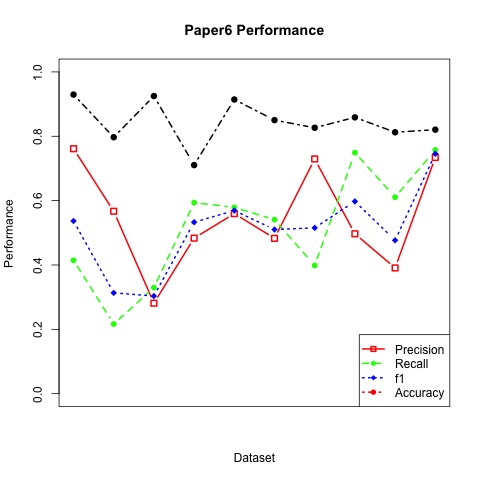

---
## **Project Summary**

* In this project, we implemented the algorithms from **paper1** and **paper6 (with C2 constraint)** to deal with name disambiguation problem. Both of the papers use unsupervised learning algorithm to cluster publications from each of the authors.


## **Paper 1**
The algorithm of paper 1 is relatively simple. We only consider explicit coauthor feature. Basically, we pairwisely cluster publications by counting matched coauthors between the two authors.

### Experiment Design
* **Features**:

Coauthor matrix
Each element xij in the matrix X represents the count of matched coauthors between publications i and j.

* **Tuned Parameters**: 

Theta = 1 
This means we will stop clustering when none of the author-pair from any two clusters share a coauthor.

* **Algorithm**: 

For the initialization, we think of each publications as a single cluster. Then we find the most similar author-pair (the maximum entry in coauthor matrix). Then we merge the corresponding two clusters into a new cluster. We iterate this process until it hits the threshold theta.

* **Evaluation**:

we use matching matrix to evaluate our results (following the function in TA's code)

Due to the imperfect data, we applied three methods trying to improve the result of the clustering algorithm.
1 Leave papers only with the main author or with one unique coauthor as individual cluster
2 Combine papers methioned above to one cluster
3 Delete those papers 

**Overall Result**:

```{r, echo=FALSE}
load("../output/paper1.RData")
result_table
```


## **Paper 6**

This paper uses a constraint-based probabilistic framework and EM algorithm to do the clustering. We only consider c2 constraint (if two publications share at least one coauthor, then they satisfy the constraint).

### Experiment Design
* **Features**: 

We use "Paper Name" and "Journal Title" to extract features for each publication. More specifically, we use TF-IDF to construct a dtm matrix as our feature matrix.   

* **Tuned parameters**:

step size = 0.01

* **Algorithm**:

objective function we want to minimize: **$\sum\limits_{i}$$\sum\limits_{j}${ D(xi,xj) I(li $\neq$ lj) w2 c2(xi,xj) } + $\sum\limits_{xi}$ D(xi,yh)**

The first term measures the distance between two publications which satisfy the constraint but not in the same cluster. The second term measures the distance between xi and its cluster centroid yh. For the initialization, we cluster publications based on c2 constraint. Then we use EM algorithm to re-assign each publication and update corresponding parameters.

* **Evaluation**:

We also use matching matrix to evaluate our results.



**Overall Result**:

```{r, echo=FALSE}
load("../output/paper6.RData")
overall_table
overall_performance
```

## **Comparison and Conclusion**

Paper | Precision | Recall | f1 | Accuracy  | Time
------------- | ------------- | ------------- | ------------- | ------------- | ------------- 
1 | 0.09 | 0.72 | 0.17 | 0.52 | 4.613901 mins  
6 | 0.55 | 0.53 | 0.54 | 0.88 | A few hours

Based on the overall performance, although it may take longer to run EM algorithm, we can see that algorithm of paper 6 is much better than that of paper 1 in general.


  

## **Thanks!**